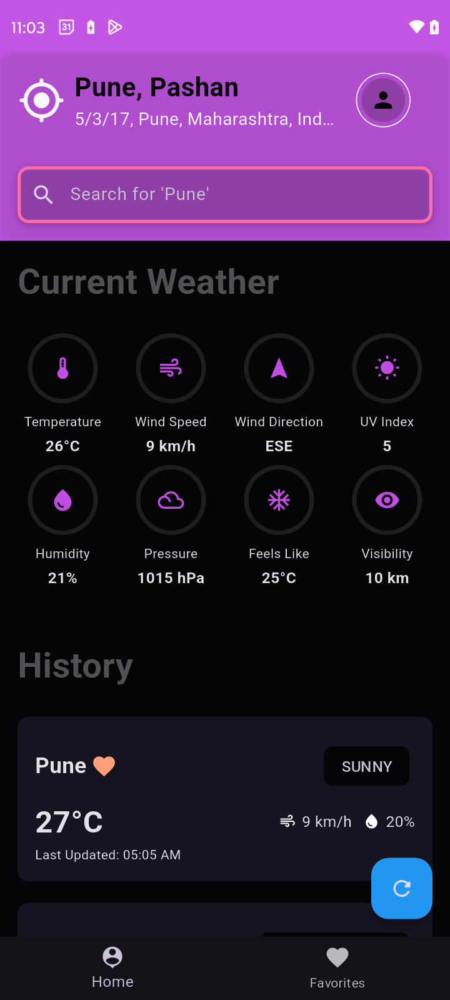

# SkyCast [Weather Search App 🌤️]

This is a Flutter-based mobile application that allows users to search for current weather information by city name, manage favorite cities, and detect the current location to display local weather details.

## Features

- **Search Weather by City**: Enter the name of any city to retrieve current weather information.
- **Weather Details**: Display interesting attributes such as temperature, humidity, wind speed, and more.
- **Favorite Cities**: Save cities to a favorites list for quick access.
- **Current Location Weather**: Automatically detect and display the weather for the user's current location.
- **Responsive Design**: Works seamlessly in both portrait and landscape modes.
- **Network Call Handling**: Includes spinners for loading states and proper error handling.

## API Used

This app uses the [OpenWeatherMap Current Weather API](https://weatherstack.com/) to fetch weather data.

### API Endpoints

- **Current Weather Data**: `http://api.weatherstack.com/current?access_key=$apiKey&query=$query`
- **Parameters**:
  - `access_key`: Your API key from OpenWeatherMap.
  - `query`: City name.

## Technical Stack

- **Framework**: Flutter
- **Language**: Dart
- **State Management**: Bloc
- **HTTP Requests**: `http` package
- **Location Detection**: `geolocator` package

## Permissions

- **Location**: To detect the user's current location and display local weather information.
- **Internet**: To fetch weather data from the API.

## Installation

1. Clone the repository:
   ```bash
   git clone https://github.com/cureius/SkyCastApp.git
   ```
2. Navigate to the project directory:
   ```bash
   cd SkyCastApp
   ```
3. Install the dependencies:
   ```bash
   flutter pub get
   ```
4. Run the app on an emulator or physical device:
   ```bash
   flutter run
   ```

## Screenshots
<p align="center">
  
  
  
  
  
  
</p>
<p align="center">
  
  
  
  
  
  
</p>


## Testing

- Unit tests and integration tests have been included to ensure code quality.
- Test coverage: 70%+.

## Contribution

Contributions are welcome! Please fork the repository and submit a pull request.
